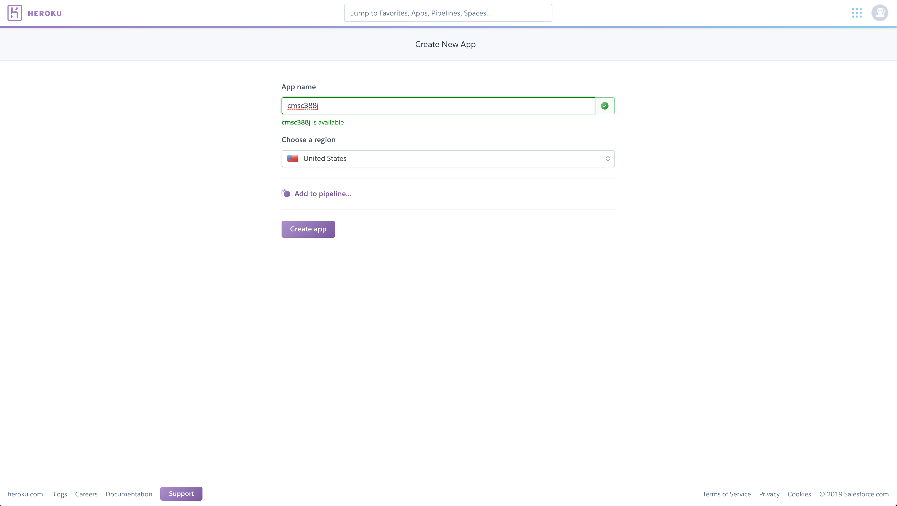

# Week 13
## Deploying your app

We'll show you two ways of deploying your app today, and you can use either of these ways
when turning in your final project.

So getting started with the first...

### Heroku

**Note**: The free plan on Heroku is not available for Teams of developers, so you should
either create an account for everyone to share or task one person with deployment with their
own account.

Make an account on the [Heroku website](https://id.heroku.com/login), and then
sign in after verifying your email or getting through any other setup it asks you to complete.

Once you log-in, you should be able to see your dashboard. Select `New -> Create new app`.
Input your desired app name, and choose the region to be **United States**.

This should look something like this:



Click `Create App`.

You'll be in the `Deploy` tab now.
There are three options for deployment. We'll go over the GitHub and CLI options:

For *either* option, you first need to `pip install gunicorn` in your app's virtual environment.
Now, run `pip freeze > requirements.txt` to generate a file of dependencies for your app.
Next, in `Procfile`, add this text:

```
web: gunicorn {app file}:app
```

**New Info (12/06/2019)**: If you're using the **application factory** pattern with the 
`create_app()` function, your `Procfile` should look like this:

```
web: gunicorn "{app_file}:create_app()"
```

**Important**: Replace `{app file}` with the name of your Python file (*without* the 
`.py` extension) that contains your app instance or your `create_app()` function. This will probably be `run` or `app` for most people (corresponding to `run.py` and `app.py`, respectively).

#### GitHub

For the GitHub option, make sure your application is uploaded to GitHub. Add your GitHub account, 
then simply select your repository. To redeploy your app everytime it's updated on GitHub, 
click the `Enable Automatic Deploys` option. The `Choose a master to deploy` option will listen
for updates on the selected branch. In our case, all development is happening on `master`, 
so we'll leave the default option.

To see your app the first time you may need to go to the `Manual Deploy` section and 
click `Deploy Branch`. You may need to occasionally manually deploy. If you
made some changes to your GitHub repo but you don't see them, you can click this button
to update the app.

Navigate to `https://my_app_name.herokuapp.com` where `my_app_name` is the name of your Heroku project.

#### CLI 

Using the `Heroku Git` option, make sure to first install the 
[Heroku CLI](https://devcenter.heroku.com/articles/heroku-cli). 

In your terminal or shell, enter `heroku login` to login from a browser, or
`heroku login -i` to login directly in the shell. 

When in your project directory, type `heroku git:remote -a {your-project-name}`.
The project name is the name of your project on Heroku.

Then, `git push heroku master`. Navigate to `https://my_app_name.herokuapp.com`, where `my_app_name`
is the name of your Heroku project.

### PythonAnywhere

After creating a new account for PythonAnywhere, you'll be presented with your dashboard as 
you login.

The easiest way to get started is to create a web app. Click `Web` at the top or 
`Open Web tab` in the Web Apps section. Select `Add a new web app`. Navigate through and
select to create a Flask app. We can pick the latest version of Python, `3.6`.

Create the app, and then go to `Consoles`. Create a new `Bash` console, and 
type in `git clone https://github.com/yashaslokesh/sample-app`, except clone your own repository
when you want to deploy.

Next, still inside the `Bash` console, type `cd ../../var/www/` to move up two directories and
then to the directory containing your server configuration file. 

Use `emacs` or `vim` to open up the `{username}_pythonanywhere_com_wsgi.py` file.
Change the last directory in the `project_home` variable to match the name of the directory
where your cloned repository sits. 

Next, alter the last line to import the `Flask` object from the appropriate Python file
in your project. In my case, my WSGI configuration file looks like this (using the `sample-app`
above):

```python
# This file contains the WSGI configuration required to serve up your
# web application at http://<your-username>.pythonanywhere.com/
# It works by setting the variable 'application' to a WSGI handler of some
# description.
#
# The below has been auto-generated for your Flask project                 
import sys
# add your project directory to the sys.path

project_home = u'/home/yashaslokesh/sample-app'
if project_home not in sys.path:
    sys.path = [project_home] + sys.path
# import flask app but need to call it "application" for WSGI to work

from app import app as application  # noqa
```

Finally, click the hamburger icon in the top right corner and go to the `Web` tab.
Scroll down to the `Code` section, and change the `Source Code` directory to
point to your code's location. In the case of my app, I set the directory to be
`/home/yashaslokesh/sample-app`.

After these changes, click the `Reload` button near the top of the `Web` tab to
update changes, then navigate to `(https://{your_username}.pythonanywhere.com/)` to
see your new web app.

### Additionally...

Not required for the final project, but if you'd like to persist data for your web app, SQLite3
won't do it for you. It's a file-based storage system, and shouldn't be used
for production applications.

For Heroku, we're provided PostgreSQL. To add this as an additional component for
your app, run `heroku addons:create heroku-postgresql:hobby-dev`. 

Then modify your configuration with this line: `app.config['SQLALCHEMY_DATABASE_URI'] = os.environ['DATABASE_URL']`, and don't forget to `import os` at the top! This will allow you to
create a PostgreSQL database on Heroku for persistent data storage.